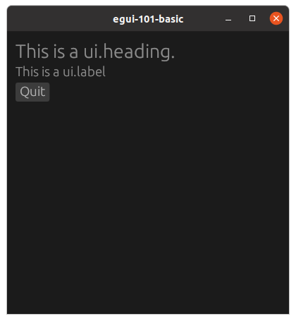

# egui-101-basic

This is a simple example with a heading, label, and button

## Source
- [src/main.rs]({{ site.codeurl }}/examples/egui-101-basic/src/main.rs)
- [Project Directory]({{ site.codeurl }}/examples/egui-101-basic)


## Screenshots



## Description

The `update` function is the workhorse of egui.  It is called up to 60 times per second to render the contents of the UI.

```rust
fn update(&mut self, ctx: &egui::CtxRef, frame: &epi::Frame) {
    ctx.set_pixels_per_point(1.5);

    egui::CentralPanel::default().show(ctx, |ui| {
        ui.heading("This is a ui.heading. ");

        ui.label("This is a ui.label");

        // This literally creates the button AND checks to see if it was clicked
        if ui.button("Quit").clicked() {
            frame.quit()
        };
    });
}
```
