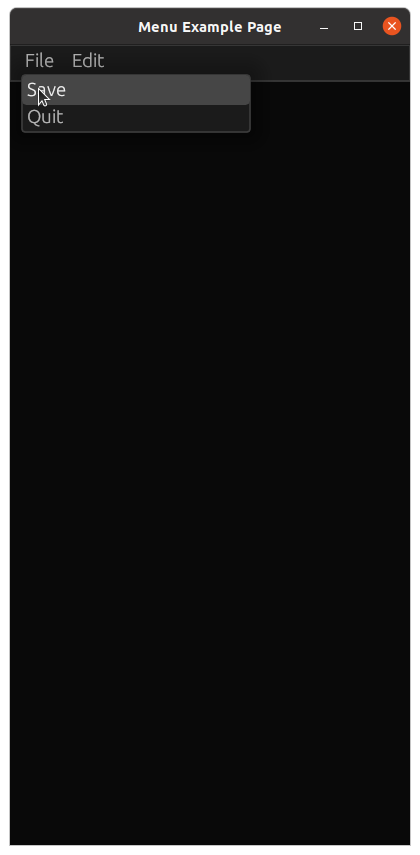

# egui-example-native-basic

This is a simple example with a menubar and multiple submenus.

Source: <{{ site.edir }}/egui-101-menu>

# # Application Screenshots




## Code

Typically, a menubar will go on the top panel. We create a `menu::bar` and populate it with a `ui.menu_button`. Each of these can contain multiple `ui.button`.

Here is the Menu code:
```rust 

        
egui::menu::bar(ui, |ui| {
    ui.menu_button("File", |ui| {
        if ui.button("Save").clicked() {
            //functionality
        }
        if ui.button("Quit").clicked() {
            frame.quit();
        }
    });
]);


```


Here is the source file: <{{ site.edir }}/egui-101-menu/str/main.rs>
