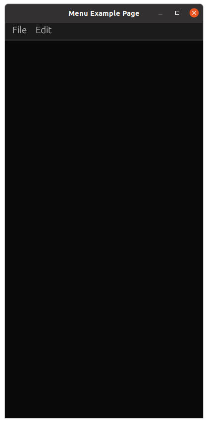
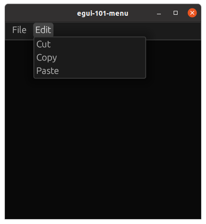

# egui-101-menu

This is a simple example with a menubar and multiple submenus.

## Source

- [src/main.rs]({{ site.codeurl }}/examples/egui-101-menu/src/main.rs)
- [Project Directory]({{ site.codeurl }}/examples/egui-101-menu)

## Screenshots




## Code

Typically, a menubar will go on the top panel. We create a `menu::bar` and populate it with a `ui.menu_button`. Each of these can contain multiple `ui.button`.

Here is an example of how to render a menu bar with a single dropdown menu:

```rust
egui::menu::bar(ui, |ui| {
    ui.menu_button("File", |ui| {
        if ui.button("Save").clicked() {
            //functionality
        }
        if ui.button("Quit").clicked() {
            std::process::exit(0);
        }
    });
});
```
