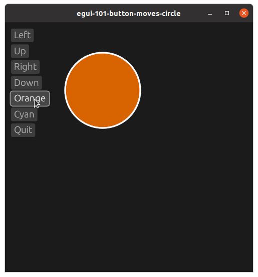
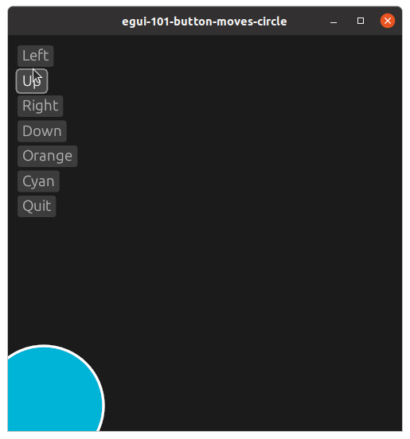

# egui-112-button-move-circle

This is a simple example of buttons that effect a circle when pressed
## Source
- [src/main.rs]({{ site.codeurl }}/examples/egui-112-button-move-circle/src/main.rs)
- [Project Directory]({{ site.codeurl }}/examples/egui-112-button-move-circle)


## Screenshots




## Description

When creating the ExampleApp struct, we add two values to hold the position of the circle, and one value to hold the color. 

```rust
struct ExampleApp {
    cx: f32,
    cy: f32,
    cc: Color32,
}
```

These values need initialized in the `Default` trait implementation. Rust will call the `default()` function and expect to get a fully initialized structure back as the return value.

```rust
impl Default for ExampleApp {
    fn default() -> Self {
        Self {
            cx: 100.0,
            cy: 100.0,
            cc: Color32::BLUE,
        }
    }
}
```

We create six buttons that effect our circle, and one to quit the application. On button press, we change our circle values.

```rust
egui::CentralPanel::default().show(ctx, |ui| {
    if ui.button("Left").clicked() {
        self.cx += -20.00
    };
    if ui.button("Up").clicked() {
        self.cy += -20.00
    };
    if ui.button("Right").clicked() {
        self.cx += 20.00
    };
    if ui.button("Down").clicked() {
        self.cy += 20.00
    };
    if ui.button("Orange").clicked() {
        self.cc = Color32::from_rgb(215, 100, 000)
    };
    if ui.button("Cyan").clicked() {
        self.cc = Color32::from_rgb(000, 180, 215)
    };
    if ui.button("Quit").clicked() {
        std::process::exit(0);
    };

    let painter = ui.painter();

    painter.circle(
        egui::Pos2{x:self.cx,y:self.cy}, 
        50.0, 
        self.cc, 
        Stroke{width: 2.0, color: Color32::from_rgb(255, 255, 255)}
    );
});
```


