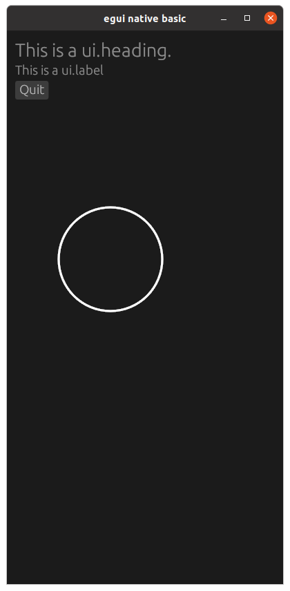

# egui-example-native-basic

This is a simple example with a heading, label, button, and circle.

## Source
- [src/main.rs]({{ site.codeurl }}/examples/egui-101-basic/src/main.rs)
- [Project Directory]({{ site.codeurl }}/examples/egui-101-basic)


## Screenshots



## Description

When creating the ExampleApp struct, we add two values to hold the position of the circle. 

```rust
struct ExampleApp {
    cx: f32,
    cy: f32,
}
```

These values need initialized in the `Default` trait implementation. Rust will call the `default()` function and expect to get a fully initialized structure back as the return value.  In rust, the last expression of a function is the return value if not otherwise specified.

```rust
impl Default for ExampleApp {
    fn default() -> Self {
        Self {
            cx: 100.0,
            cy: 100.0,
        }
    }
}
```

To actually draw the circle, we use an [egui::painter::Painter](https://docs.rs/egui/latest/egui/struct.Painter.html#method.circle) struct.  It takes four arguments: position, radius, color, and stroke.

```rust
let painter = ui.painter();

painter.circle(
    egui::Pos2{x:self.cx,y:self.cy}, 
    50.0, 
    egui::color::Color32::TRANSPARENT, 
    egui::epaint::Stroke{width: 2.0, color: egui::color::Color32::from_rgb(255, 255, 255)}
);
```


