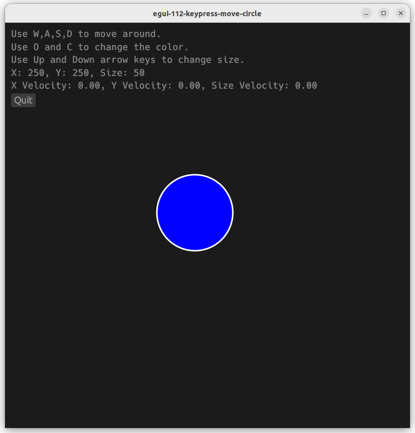
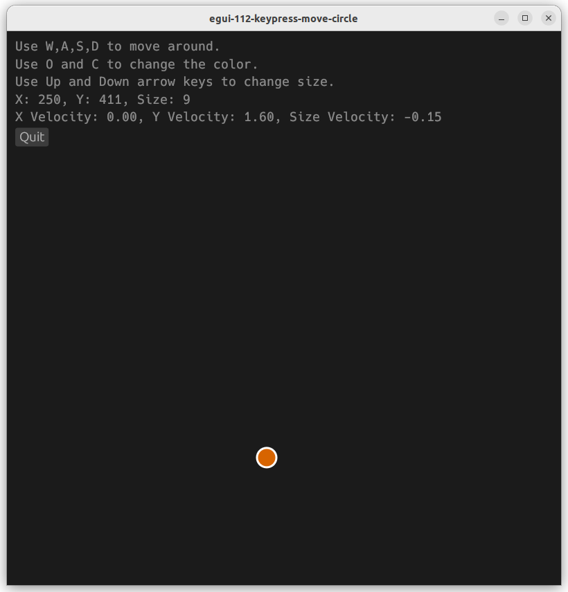

# egui-112-keypress-move-circle-with-velocity

This is a simple example of keypressing to change the velocity of a circle, causing it to move around the screen.

## Source
- [src/main.rs]({{ site.codeurl }}/examples/egui-112-keypress-move-circle-with-velocity/src/main.rs)
- [Project Directory]({{ site.codeurl }}/examples/egui-112-keypress-move-circle-with-velocity)


## Screenshots




## Description

When creating the ExampleApp struct, we add two values to hold the position of the circle, and one value to hold the size, and one value for the color. 

```rust
struct ExampleApp {
    vx: f32,
    vy: f32,
    vs: f32,
    cx: f32,
    cy: f32,
    cs: f32,
    cc: Color32,
}
```

These values need initialized in the `Default` trait implementation. Rust will call the `default()` function and expect to get a fully initialized structure back as the return value.

```rust
impl Default for ExampleApp {
    fn default() -> Self {
        Self {
            vx: 0.0,
            vy: 0.0,
            vs: 0.0,
            cx: 100.0,
            cy: 100.0,
            cs: 50.0,
            cc: Color32::BLUE,
        }
    }
}
```

We use `ctx.input().key_pressed()` to check if a specific key is pressed everytime `update()` is called. If the key is pressed, we change one of our values. 

W,A,S,D to move around, and UP,DOWN to change size, C,O to change color.

```rust
fn update(&mut self, ctx: &egui::Context, frame: &mut eframe::Frame) {
    
    ctx.set_pixels_per_point(1.5);

    if ctx.input().key_pressed(egui::Key::W) {
        self.vy += -20.00
    }
    if ctx.input().key_pressed(egui::Key::S) {
        self.vy += 20.00
    }
    if ctx.input().key_pressed(egui::Key::A) {
        self.vx += -20.00
    }
    if ctx.input().key_pressed(egui::Key::D) {
        self.vx += 20.00
    }
    if ctx.input().key_pressed(egui::Key::ArrowUp){
        self.vs += 5.0
    }
    if ctx.input().key_pressed(egui::Key::ArrowDown){
        self.vs += -5.0
    }

    egui::CentralPanel::default().show(ctx, |ui| {
        if ui.button("Quit").clicked() {
            frame.quit()
        };

        let painter = ui.painter();

        painter.circle(
            egui::Pos2{x:self.cx,y:self.cy}, 
            self.cs, 
            self.cc, 
            Stroke{width: 2.0, color: Color32::from_rgb(255, 255, 255)}
        );
    });
}
```


