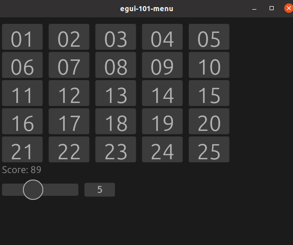

# egui-122-button-grid

## Source
- [src/main.rs]({{ site.codeurl }}/examples/egui-122-button-grid/src/main.rs)
- [Project Directory]({{ site.codeurl }}/examples/egui-122-button-grid)

## Screenshots

## Description

A example of buttons, sliders, and grids in egui. You can resize the grid using the slider, and click buttons to add to the score.

