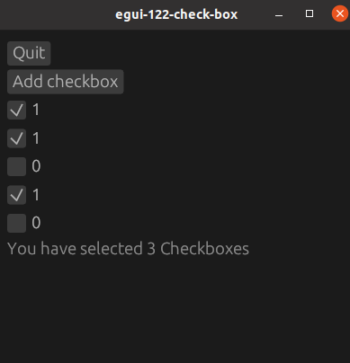

# egui-122-check-box

## Source
- [src/main.rs]({{ site.codeurl }}/examples/egui-122-check-box/src/main.rs)
- [Project Directory]({{ site.codeurl }}/examples/egui-122-check-box)

## Screenshots

## Description

A widget for check boxes in egui, you can create a checkbox, and store bit values using it.

