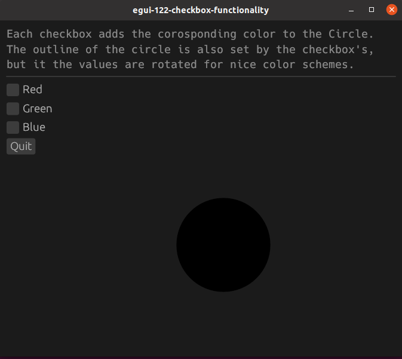

# egui-122-checkbox-functionality

This is an example of using checkboxes to change the color of a circle

## Source
- [src/main.rs]({{ site.codeurl }}/examples/egui-122-checkbox-functionality/src/main.rs)
- [Project Directory]({{ site.codeurl }}/examples/egui-122-checkbox-functionality)


## Screenshots




## Description
Checkboxes, `egui::widgets::Checkbox`, take two parameters. A mutable `bool` and a `string`.

We first create and initialize our struct with the boolean variable for each checkbox. For this example, the default value is false. We'll also create a variable for color values, set as `u8`.

```rust
pub struct ExampleApp {
    red: bool,
    green: bool,
    blue: bool,
    r: u8,
    g: u8,
    b: u8,
}

impl Default for ExampleApp {
    fn default() -> Self {
        Self {
            red: false,
            green: false,
            blue: false,
            r: 0,
            g: 0,
            b: 0,
        }
    }
}
```

We create a checkbox with `ui.checkbox()` which we pass our boolean variable to, and we also give it a label. Checking the box will change the value to true.

```rust
ui.checkbox(&mut self.red, "Red");
ui.checkbox(&mut self.green, "Green");
ui.checkbox(&mut self.blue, "Blue");
```

We will put our color variables into a circle. The circle outline takes the same variables but in a different order, just to mix it up a bit.

```rust
ui.painter().circle(
    egui::Pos2{x:250.0,y:250.0},
    50.0, 
    Color32::from_rgb(self.r, self.g, self.b), 
    Stroke{width: 5.0, color: Color32::from_rgb(self.g, self.b, self.r)}
);
```

If one of our checkbox values becomes true, we change our color variable.

```rust
if self.red {
    self.r = 200;
}
else {
    self.r = 0;
}
if self.green {
    self.g = 200;
}
else {
    self.g = 0;
}
if self.blue {
    self.b = 200;
}
else {
    self.b = 0;
}
```


