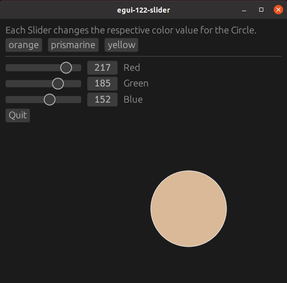
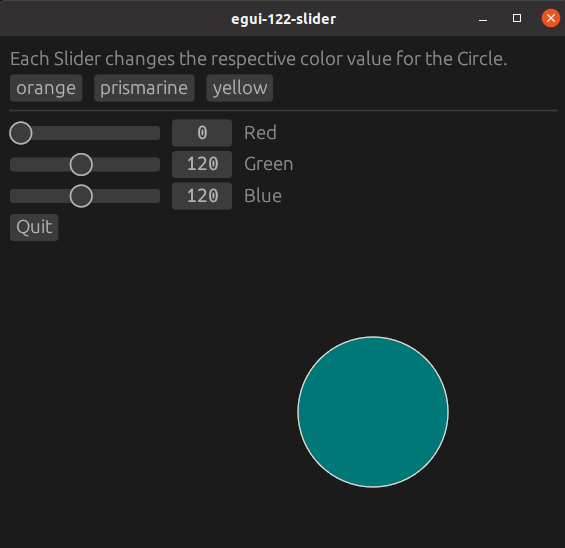

# egui-122-slider

This is an example of using checkboxes to change the color of a circle

## Source

- [src/main.rs]({{ site.codeurl }}/examples/egui-122-slider/src/main.rs)
- [Project Directory]({{ site.codeurl }}/examples/egui-122-slider)

## Screenshots




## Description

Sliders, `egui::Slider`, take two parameters. A mutable variable for the slider value, and a range.

We will create and initialize our color values. They are `u8` so we can easily use the values in `Color32::from_rgb()`

```rust
pub struct ExampleApp {
    red: u8,
    green: u8,
    blue: u8,
}

impl Default for ExampleApp {
    fn default() -> Self {
        Self {
            red: 0,
            green: 0,
            blue: 0,
        }
    }
}
```

We create the sliders like this:

```rust
ui.add(egui::Slider::new(&mut self.red, 0..=255).text("Red"));
ui.add(egui::Slider::new(&mut self.green, 0..=255).text("Green"));
ui.add(egui::Slider::new(&mut self.blue, 0..=255).text("Blue"));
```

We pass it the respective variable and a range. The `.text("label")` is optional. It will create a label beside the slider.

We can change the values in other ways too. Here we use buttons to set our color values. This change will immedietly be reflected on the slider.

```rust
if ui.button("orange").clicked() {
    self.red = 255;
    self.green = 100;
    self.blue = 0;
};
```

We will put our color variables into a circle.

```rust
ui.painter().circle(
    egui::Pos2{x:250.0,y:250.0},
    50.0,
    Color32::from_rgb(self.red, self.green, self.blue),
    Stroke{width: 0.5, color: Color32::from_rgb(255, 255, 255)}
);
```
