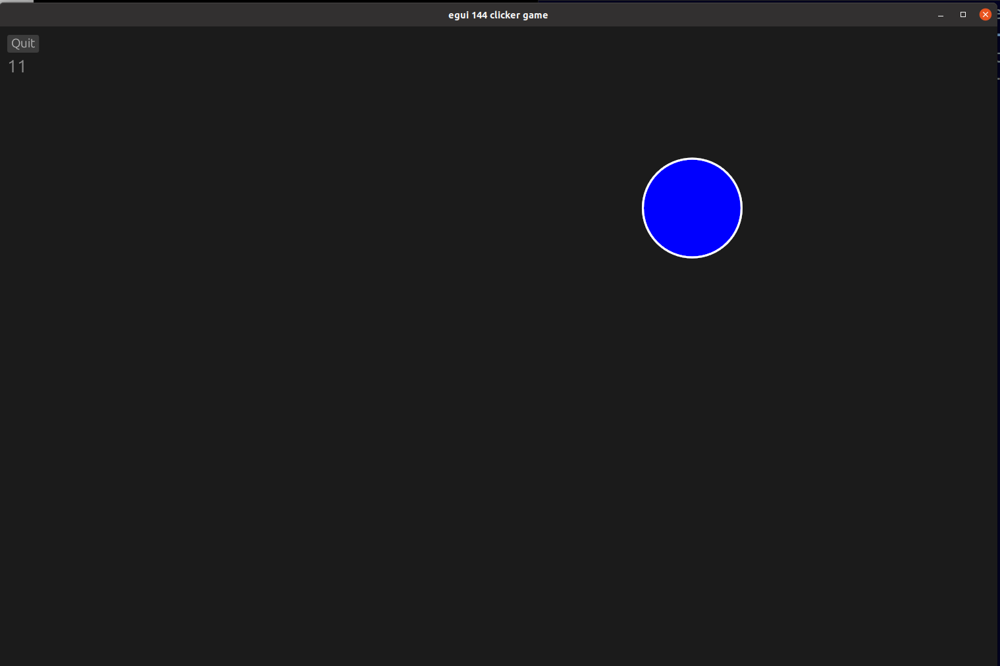

## egui-144-clicker-game
    This is a simple example of a basic clicker game.

## Source
- [src/main.rs]({{ site.codeurl }}/examples/egui-144-clicker-game/src/main.rs)
- [Project Directory]({{ site.codeurl }}/examples/egui-144-clicker-game)


## Screenshots



## Description

When creating the ExampleApp struct, we add two values to hold the position of the circle, as well as a value to count the number of times the circle is clicked.

```rust
struct ExampleApp {
    x: f32,
    y: f32,
    c: i32,
    screen_rect: Rect,
}
```

These values need initialized in the `Default` trait implementation. Rust will call the `default()` function and expect to get a fully initialized structure back as the return value.  In rust, the last expression of a function is the return value if not otherwise specified.

```rust
impl Default for ExampleApp {
    fn default() -> Self {
        Self {
            x: 250.0,
            y: 250.0,
            c: 0,
            screen_rect: Rect{min: Pos2{x: 0.0, y: 0.0}, max: Pos2{x: 1000.0, y: 700.0}},
        }
    }
}
```

We create a ui.heading to display the score in the top left, to actually draw the circle, we use a ui.painter.circle struct. It takes four arguments: position, radius, color, and stroke.

```rust
ui.heading(self.c.to_string()); // Displays the score
let painter = ui.painter();

painter.circle (
    egui::Pos2{x:self.x,y:self.y}, 
    50.0, 
    Color32::BLUE, 
    Stroke{width: 2.0, color: Color32::from_rgb(255, 255, 255)}
);
```

Every time the program updates, it checks if the circle was clicked by checking if the mouse is down, and if the mousepos is 50 px away from the circle's x and y variables. If the circle was clicked, it sets the circle's x and y to random numbers inside the window, as well as adding one to the c variable (the score).

```rust
fn update(&mut self, ctx: &egui::CtxRef, frame: &epi::Frame) {
    // On each frame, set 1.5 pixels per point
    ctx.set_pixels_per_point(1.5);
    let pointer = &ctx.input().pointer;
    if let Some(mousepos) = pointer.hover_pos() {
        if pointer.any_click() {
            if mousepos.distance(egui::Pos2{x:self.x,y:self.y}) < 50.0 {
                self.x = rand::thread_rng().gen_range(self.screen_rect.min.x..self.screen_rect.max.x);
                self.y = rand::thread_rng().gen_range(self.screen_rect.min.y..self.screen_rect.max.y);
                self.c += 1;
            }
        }
    }
```


