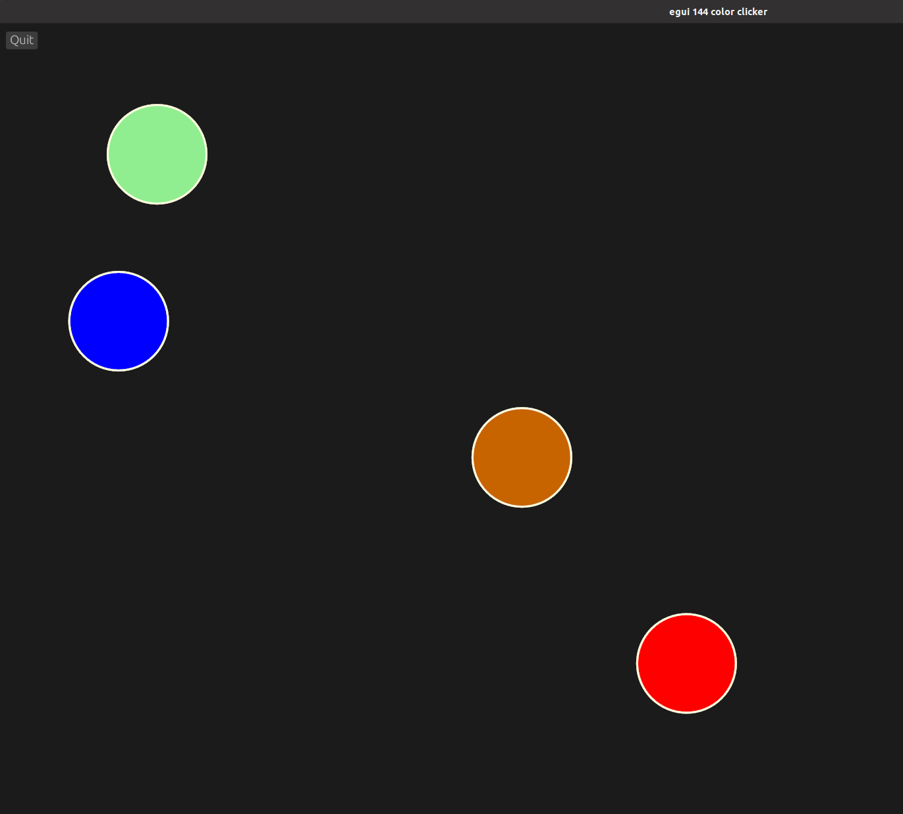
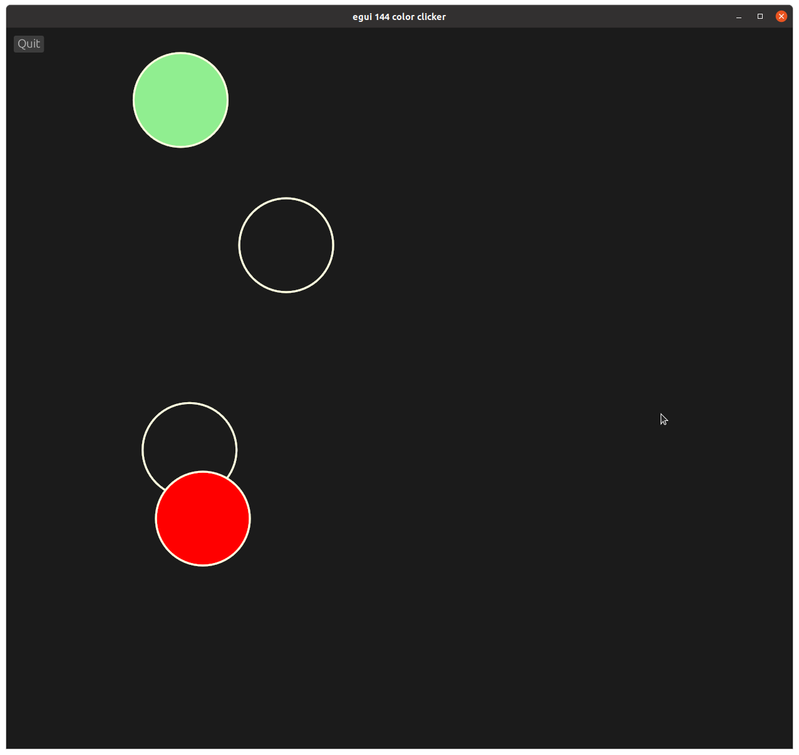

# egui-144-color-clicker

This is an example of a super simple game with 4 circles to click

## Source

- [src/main.rs]({{ site.codeurl }}/examples/egui-144-color-clicker/src/main.rs)
- [Project Directory]({{ site.codeurl }}/examples/egui-144-color-clicker)

## Screenshots




## Description

On click, we compare the mouse position to the center position of our circles. if the mouse is on a circle, that circle goes transparent.

```rust
let (hover_pos, any_down) = ctx.input(|input| (input.pointer.hover_pos(), input.pointer.any_down()));

if let Some(mousepos) = hover_pos {
    if any_down {
        if mousepos.distance(egui::Pos2{x:self.x1,y:self.y1}) < 50.0 {
            self.c1 = Color32::TRANSPARENT;
        }
        if mousepos.distance(egui::Pos2{x:self.x2,y:self.y2}) < 50.0 {
            self.c2 = Color32::TRANSPARENT;
        }
        if mousepos.distance(egui::Pos2{x:self.x3,y:self.y3}) < 50.0 {
            self.c3 = Color32::TRANSPARENT;
        }
        if mousepos.distance(egui::Pos2{x:self.x4,y:self.y4}) < 50.0 {
            self.c4 = Color32::TRANSPARENT;
        }

    }
}
```

Once they've all been clicked, we randomize their position and give them color back.

```rust
if self.c1 == self.c2 && self.c3 == self.c4 {
    self.x1 = rand::thread_rng().gen_range(50.0..700.0);
    self.y1 = rand::thread_rng().gen_range(50.0..700.0);
    self.c1 = Color32::from_rgb(200,100,000);
    self.x2 = rand::thread_rng().gen_range(50.0..700.0);
    self.y2 = rand::thread_rng().gen_range(50.0..700.0);
    self.c2 = Color32::BLUE;
    self.x3 = rand::thread_rng().gen_range(50.0..700.0);
    self.y3 = rand::thread_rng().gen_range(50.0..700.0);
    self.c3 = Color32::RED;
    self.x4 = rand::thread_rng().gen_range(50.0..700.0);
    self.y4 = rand::thread_rng().gen_range(50.0..700.0);
    self.c4 = Color32::LIGHT_GREEN;

}
```
