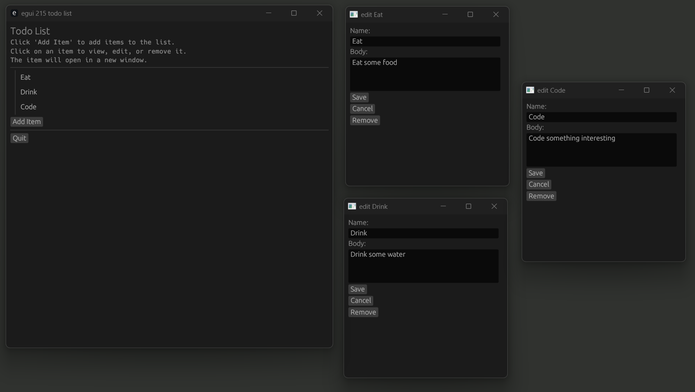

## egui-215-todo-list

    This is an example of a multi-window todo list.

## Source

- [src/main.rs]({{ site.codeurl }}/examples/egui-215-todo-list/src/main.rs)
- [Project Directory]({{ site.codeurl }}/examples/egui-215-todo-list)

## Screenshots



## Description

Before creating our App struct, we create a struct to hold the information about each todo item.

```rust
#[derive(Clone)]
struct TodoItem {
    name: String,
    body: String,
}

impl Default for TodoItem {
    fn default() -> Self {
        Self {
            name: "New Todo Item".to_owned(),
            body: String::new(),
        }
    }
}
```

Then we create our `ExampleApp` struct which contains our todo items as a map of an id to an item, the next valid id, and the currently edited items for which to have editor windows.

```rust
struct ExampleApp {
    // The todo items, with a unique u32 identifier
    items: HashMap<u32, TodoItem>,
    // A counter to keep track of the next valid ID -- it is incremented every time it's used
    next_id: u32,

    // the currently edited items, they each have their own intermediate state
    currently_edited: HashMap<u32, TodoItem>,
}
```

We open an editor window by inserting an intermediate TodoItem into `ExampleApp::currently_edited` which we will later make sure opens a window.
In this case we insert it to `(id, item)` where `id` and `item` are clones of an id or item from our `ExampleApp::items` field.

```rust
// For every item, show its name as a clickable label.
for (id, item) in items {
    // Add some spacing to let it breathe
    ui.add_space(5.0);

    // Add a clickable label using egui::Label::sense()
    if ui
        .add(egui::Label::new(&item.name).sense(egui::Sense::click()))
        .clicked()
    {
        // Set this item to be currently edited, if it isn't already
        if !self.currently_edited.contains_key(&id) {
            self.currently_edited.insert(id, item);
        }
    };

    // Add some spacing to let it breathe
    ui.add_space(5.0);
}
```

Then we have to keep calling `egui::Context::show_viewport_immediate`.
Calling it only once will make a window appear only once, while calling it every frame will keep it from closing.

We give `egui::Context::show_viewport_immediate` a function that receives a `&egui::Context` and can render UI using it as normal.
In that function we can also mutate our `self` variable (our instance of `ExampleApp`)

```rust
// If we're currently editing items, we have to keep calling ctx.show_viewport_immediate for every editor window, with its own id
for id in keys {
    // Take out the item we're using so we can mutate it
    let mut item = self.currently_edited.remove(&id).unwrap();

    // This viewport id has to be unique and persistent across frames
    let viewport_id = egui::ViewportId::from_hash_of(format!("edit {id}"));
    let viewport_builder = egui::ViewportBuilder::default()
        .with_inner_size((300.0, 300.0))
        .with_title(format!("edit {}", item.name));

    // This function is like eframe::App::update, except it can access ExampleApp as well
    let viewport_cb = |ctx: &egui::Context, _| {
        egui::CentralPanel::default().show(ctx, |ui| {
            ui.label("Name:");
            ui.text_edit_singleline(&mut item.name);
            ui.label("Body:");
            ui.text_edit_multiline(&mut item.body);

            if ui.button("Save").clicked() {
                // Insert our changed item at the id
                self.items.insert(id, item);

                // Remove this item from being edited
                self.currently_edited.remove(&id);
            } else if ui.button("Cancel").clicked()
                || ctx.input(|i| i.viewport().close_requested())
            {
                // Remove this item from being edited
                self.currently_edited.remove(&id);
            } else if ui.button("Remove").clicked() {
                // Remove the currently edited item
                self.items.remove(&id);

                // Remove this item from being edited
                self.currently_edited.remove(&id);
            } else {
                // Otherwise reinsert the item again so the window won't close
                self.currently_edited.insert(id, item);
            }
        });
    };

    ctx.show_viewport_immediate(viewport_id, viewport_builder, viewport_cb);
}
```
