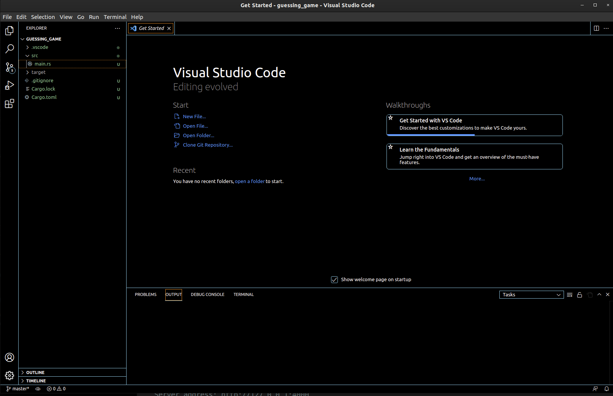
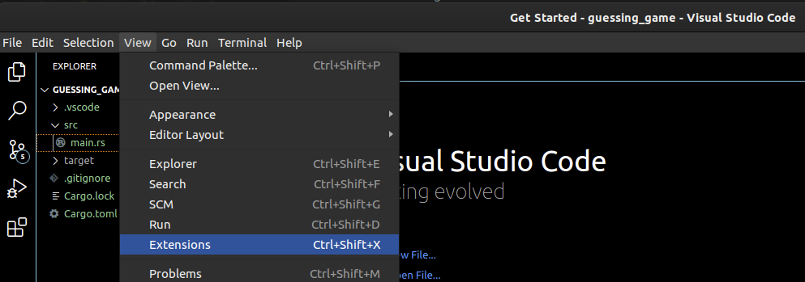
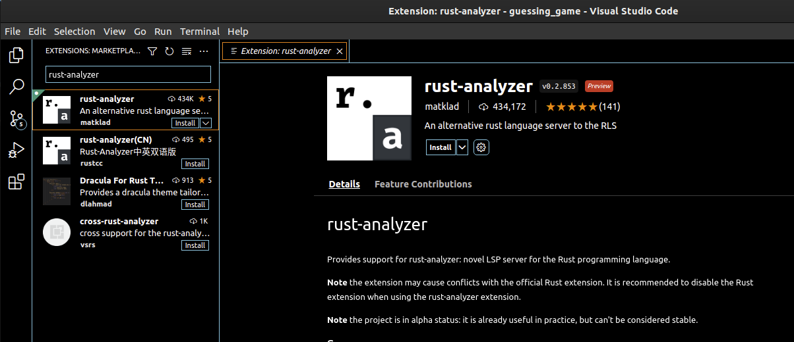

This page contains information on how to get setup to develop in egui. The best way to learn egui and Rust is to use working examples. You are going to need to install Rust. We recommend using Visual Studio Code as your IDE to assist in programming Rust. After installing VSCode, you will need to install an extension also. After that we will go over how to install and run working examples.

## Install Rust

The following Rust installation instructions are a summary from the [official installation guide](https://www.rust-lang.org/learn/get-started).

Rust uses an installer and version management tool called Rustup. To install Rustup on a Unix-like OS, run the following command:

```bash
curl --proto '=https' --tlsv1.2 -sSf https://sh.rustup.rs | sh
```

After the needed files have downloaded and installation has initiated, you will be prompted to choose your setup option. Use the default option - #1.

```
Current installation options:
   default host triple: x86_64-unknown-linux-gnu
     default toolchain: stable (default)
               profile: default
  modify PATH variable: yes

1) Proceed with installation (default)
2) Customize installation
3) Cancel installation
>
```

Once setup has successfully completed, you should be shown confirmation text.

```
Rust is installed now. Great!

To get started you may need to restart your current shell.
This would reload your PATH environment variable to include
Cargo's bin directory ($HOME/.cargo/bin).

To configure your current shell, runs:
source $HOME/.cargo/env
```

There are a few dependencies for needed egui native backed to compile properly on Ubuntu. Run the following command to install these dependencies:

`sudo apt-get install libxcb-render0-dev libxcb-shape0-dev libxcb-xfixes0-dev libspeechd-dev libxkbcommon-dev libssl-dev`

## Install Visual Studio Code

If you are running a Debian or Ubuntu based operating system, you should be able to use apt package manager to install VSCode. First update your package cache with this command:

```bash
sudo apt update
```

After the update is complete, install VSCode using apt:

```bash
sudo apt install code
```

The default Visual Studio Code installation should have a symlink in /usr/bin/code. Open VSCode with this command:

```bash
/usr/bin/code
```

VSCode should open momentarily and show a window something like this.



## Install rust-analyzer for VSCode

Now we need to install an extension for the IDE to work better when programming in Rust. On the View menu in VSCode, select Extensions.



Search for the term `rust-analyzer` in the Extensions search box and select the Extension shown below. Click `Install` to install the VSCode Rust extension.



## Setup egui.info

Next, we will clone the egui.info project git repository. For this example, install the project into `/home/<user_directory>/Code/`. We will use this for our example.

```bash
cd ~/Code
git clone git@github.com:appcove/egui.info.git
```

After git is finished cloning the repository, change directories into our example of a simple native Rust application and run cargo.

Note: Upon running a Rust application for the first time, it can take considerable time to install all dependencies.

```bash
cd examples/egui-example-native-basic
cargo run
```


